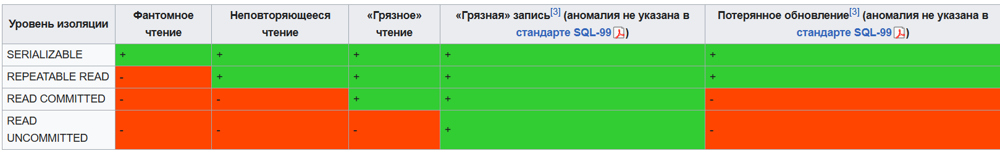

## Уровни изоляции транзакций в БД

Грязное чтение (Dirty Read) — когда данные, которые я прочитал, кто-то может откатить ещё до того, как я завершу свою транзакцию.

Потерянное обновление (Lost Update) — когда две транзакции одновременно читают и изменяют одни и те же данные, и при этом одно из изменений может потеряться.

Неупорядоченное чтение (Out‑of‑order Read) — когда несколько чтений выполняются в произвольном порядке, что может привести к неправильным результатам в транзакциях.

### Read uncommitted (чтение незафиксированных данных)
Если несколько параллельных транзакций пытаются изменять одну и ту же строку таблицы, то в окончательном варианте строка будет иметь значение, определённое всем набором успешно выполненных транзакций. При этом возможно считывание не только логически несогласованных данных, но и данных, изменения которых ещё не зафиксированы.

> Это самый слабый уровень изоляции, когда транзакция может видеть результаты других транзакций, даже если они ещё не закоммичены.

### Read committed (чтение фиксированных данных)
> На этом уровне обеспечивается защита от чернового, «грязного» чтения, тем не менее, в процессе работы одной транзакции другая может быть успешно завершена и сделанные ею изменения зафиксированы. В итоге первая транзакция будет работать с другим набором данных.

Реализация чтения зафиксированных данных может основываться на одном из двух подходов: блокировании или версионности.

### Repeatable read (повторяющееся чтение)
> Этот уровень означает, что пока транзакция не завершится, никто параллельно не может изменять или удалять строки, которые транзакция уже прочитала. Т. е. данные, которые я прочитал своей транзакцией, точно никто не изменит, пока я не завершу свою транзакцию (по крайней мере, в классическом понимании этого уровня с блокировками).

> Это нас спасает и от грязного чтения, и от неповторяющегося чтения, но всё ещё мы не решаем проблему фантомного чтения.

Блокировки в разделяющем режиме применяются ко всем данным, считываемым любой инструкцией транзакции, и сохраняются до её завершения. Это запрещает другим транзакциям изменять строки, которые были считаны незавершённой транзакцией. Однако другие транзакции могут вставлять новые строки, соответствующие условиям поиска инструкций, содержащихся в текущей транзакции. При повторном запуске инструкции текущей транзакцией будут извлечены новые строки, что приведёт к фантомному чтению. Учитывая то, что разделяющие блокировки сохраняются до завершения транзакции, а не снимаются в конце каждой инструкции, степень параллелизма ниже, чем при уровне изоляции READ COMMITTED. Поэтому пользоваться данным и более высокими уровнями изоляции транзакций без необходимости обычно не рекомендуется.

## Serializable (упорядочиваемость)
Самый высокий уровень изолированности; транзакции полностью изолируются друг от друга. Результат выполнения нескольких параллельных транзакций должен быть таким, как если бы они выполнялись последовательно. Только на этом уровне параллельные транзакции не подвержены эффекту «фантомного чтения».

Это может достигаться за счет того, что изменяющая транзакция блокирует всю таблицу для изменяющих и читающих транзакций, а также читающая транзакция блокирует всю таблицу для изменяющих транзакций. Или менее радикальное — изменяющая транзакция блокирует строки для тех транзакций, которые захватывают этот диапазон строк, в котором находится изменяющая транзакция, а также читающая транзакция блокирует строки для тех изменяющих транзакций, которые захватывают этот диапазон строк, в котором находится читающая транзакция.