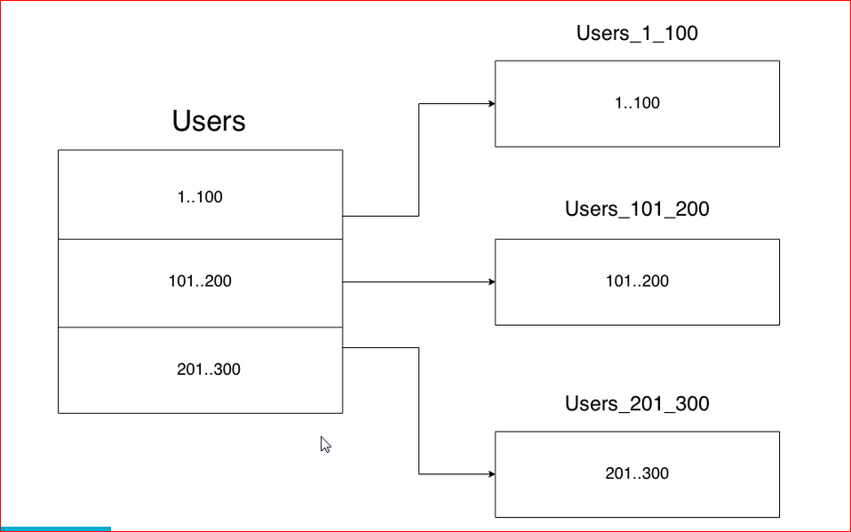
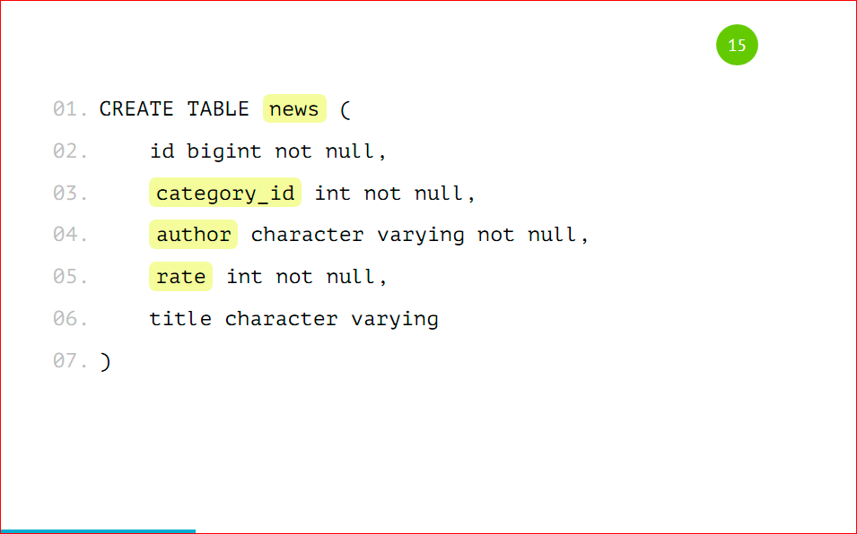
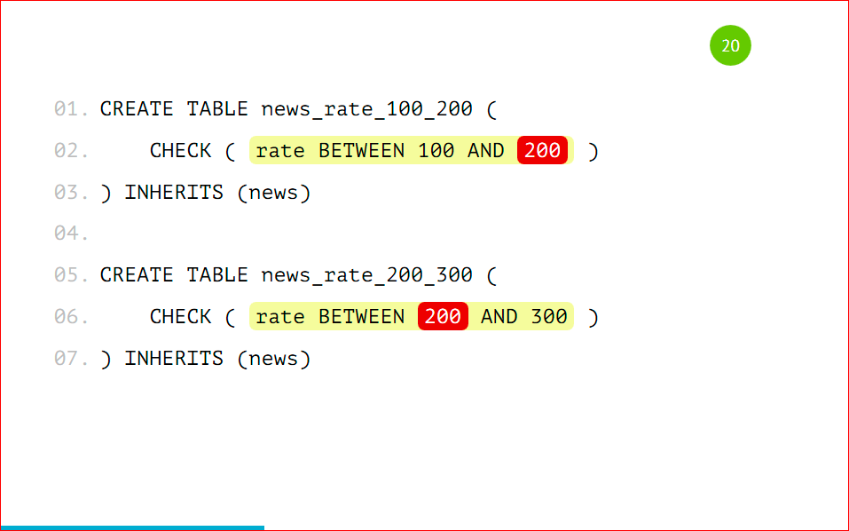
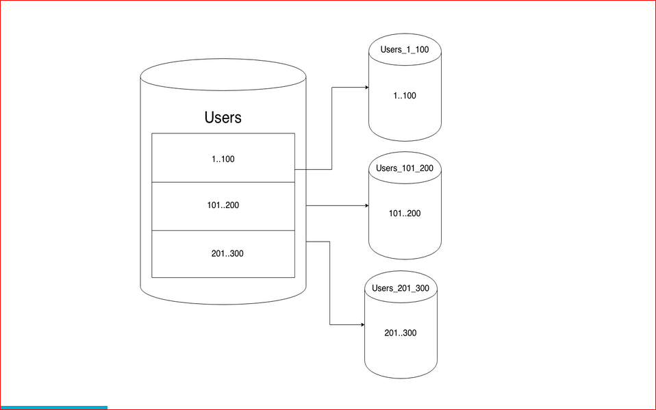
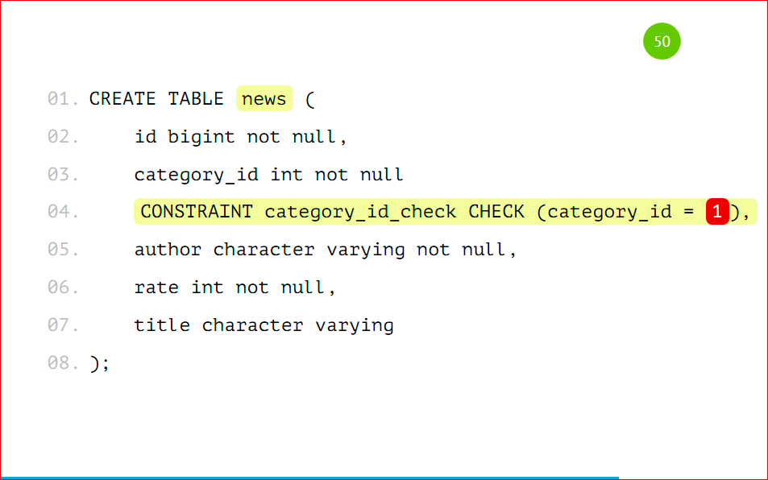
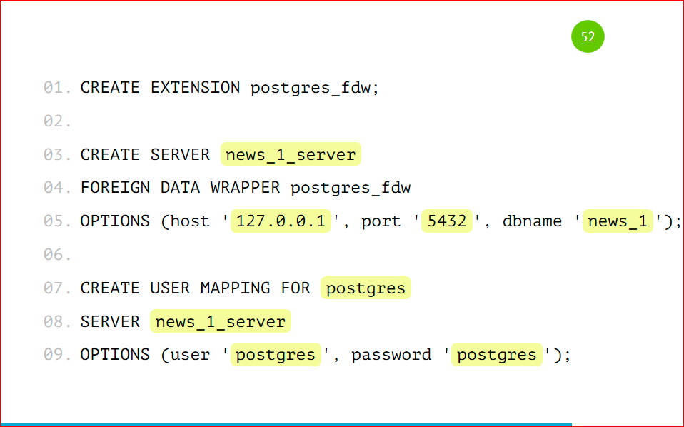
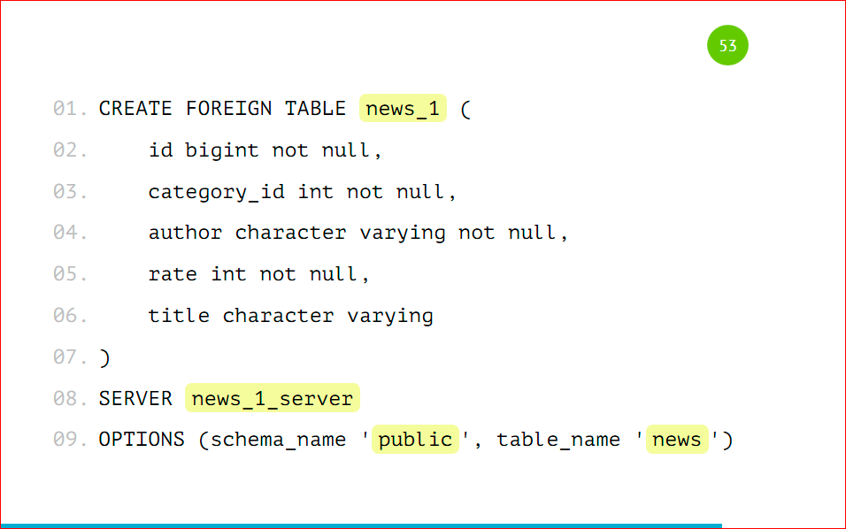
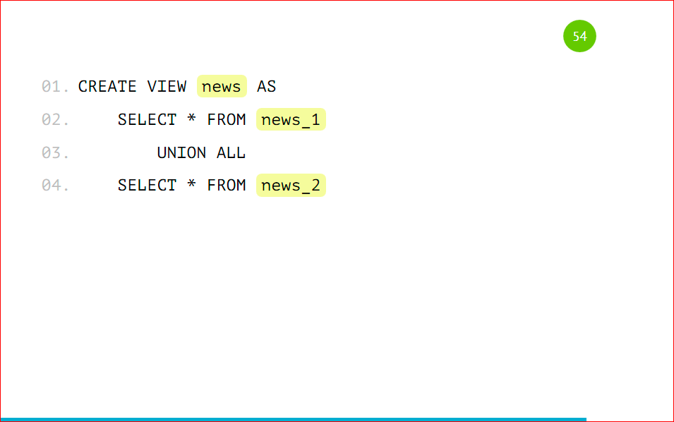

# Шардирование

## Вертикальный шардинг (партицирование)
`Партицирование` — это когда мы одну большую таблицу разделяем на много маленьких по какому-либо принципу.

## Как делается в коде
Делаем мейн таблицу

Создаем правило - ограничение

> Проблема знаменитостей - иногда разделение приводит к неравномерному распределению данных и нагрузки.

## Вертикальный шардинг
С горизонтальным шардингом все примерно так же, но при этом у нас таблички лежат в разных базах на других инстансах.

Тоже самое только добавим CONSTRAINT

Настраиваем шардинг на основном сервере

Заводим таблицу на основном сервере

Покрываем через view 

Далее можно настроить правила ...

# Реплики

`Master-Slave` - мастер пишет, несколько слейвов читают. Если мастер выйдет из строя - то слейв становится мастером.

`Master-Master` - мастеры и пишут и читают. Сложность в синхронизации данных.

