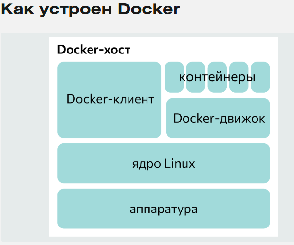

## Docker
- это программа для развертывания и доставки контейнерных приложений.

## Зачем нужен
- Выкладывание и развертывание приложений
- Изоляция приложений
- Удобное масштабирование

## Архитектура Docker
`Docker-демон` - запускается на хост-машине. Пользователь не взаимодействует с сервером на прямую, а использует для этого клиент.

`Docker-клиент` - главный интерфейс к Docker. Она получает команды от пользователя и взаимодействует с docker-демоном.

`Docker-образ` - это read-only шаблон, который содержит в себе какое-то приложение/софт.

`Docker-реестр` хранит образы. Есть публичные и приватные реестры, из которых можно скачать либо загрузить образы. Публичный Docker-реестр — это Docker Hub. Там хранится огромная коллекция образов. Как вы знаете, образы могут быть созданы вами или вы можете использовать образы созданные другими. Реестры — это компонента распространения

`Docker Контейнеры` похожи на директории. В контейнерах содержится все, что нужно для работы приложения. Каждый контейнер создается из образа. Контейнеры могут быть созданы, запущены, остановлены, перенесены или удалены. Каждый контейнер изолирован и является безопасной платформой для приложения. Контейнеры — это компонента работы.



## Порядок работы docker
- `Cкачивает образ ubuntu`: docker проверяет наличие образа ubuntu на локальной машине, и если его нет — то скачивает его с Docker Hub.
- `Cоздает контейнер`: когда образ получен, docker использует его для создания контейнера;
- `Инициализирует файловую систему` и монтирует read-only уровень: контейнер создан в файловой системе и read-only уровень добавлен образ;
- `Инициализирует сеть/мост`: создает сетевой интерфейс, который позволяет docker-у общаться хост машиной;
- `Установка IP адреса`: находит и задает адрес;
- `Запускает указанный процесс`: запускает ваше приложение;
- `Обрабатывает и выдает вывод вашего приложения`: подключается и логирует стандартный вход, вывод и поток ошибок вашего приложения, что бы вы могли отслеживать как работает ваше приложение.

## Docker-Compose

Считается, что один контейнер должен выполнять одну функцию. Поэтому для настройки сложной среды понадобится несколько образов.


## Примеры docker

```docker
# Используем базовый образ с Python 3.10
# Этот образ будет служить отправной точкой для нашего Docker-образа.
# Мы выбираем python:3.10-slim-bullseye, как легкий вариант с Debian Bullseye.
FROM python:3.10-slim-bullseye as builder

# Устанавливаем рабочую директорию внутри контейнера
# Все последующие команды будут выполняться относительно этой директории.
WORKDIR /app

# Копируем requirements.txt в рабочую директорию
# Это нужно для установки зависимостей.
COPY requirements.txt .

# Устанавливаем зависимости, указанные в requirements.txt
# --no-cache-dir используется для уменьшения размера образа.
# -r requirements.txt указывает pip установить все пакеты, перечисленные в этом файле.
RUN pip install --no-cache-dir -r requirements.txt

# Создаем stage для production образа
# Теперь создаем отдельный stage, чтобы перенести только необходимые файлы и не засорять production-образ.
FROM python:3.10-slim-bullseye

# Устанавливаем рабочую директорию внутри контейнера.
WORKDIR /app

# Копируем исходный код приложения в рабочую директорию
# Эта инструкция копирует все файлы из текущего каталога в /app в контейнере.
COPY . .

# Копируем установленные зависимости из предыдущего этапа.
# Это позволяет перенести установленные зависимости из stage `builder` в текущий stage.
COPY --from=builder /usr/local/lib/python3.10/site-packages /usr/local/lib/python3.10/site-packages

# Копируем скрипт entrypoint
COPY ./entrypoint.sh /app/entrypoint.sh

# Делаем скрипт исполняемым
RUN chmod +x /app/entrypoint.sh

# Открываем порт 8080 для доступа к приложению извне.
EXPOSE 8080

# Указываем команду для запуска приложения при старте контейнера.
# Теперь контейнер запустит `entrypoint.sh` вместо стандартного интерпретатора Python.
ENTRYPOINT ["/app/entrypoint.sh"]
```

## Compose примеры

```docker
version: "3.8"  # Версия файла docker-compose, может зависеть от версии Docker Compose

services:
  web:  # Определение сервиса веб-приложения
    build:  # Определение параметров сборки образа
      context: .  # Указывает текущую директорию как контекст для сборки Dockerfile
      dockerfile: Dockerfile  # Указывает имя Dockerfile, используемого для сборки
    ports: # Определение портов для доступа к сервису извне
      - "8080:8080" # Пробрасывает порт 8080 хоста на порт 8080 контейнера
    depends_on: # Зависимости этого сервиса
      - db  # Сервис web зависит от сервиса db
      - redis # Сервис web зависит от сервиса redis
    environment: # Переменные среды для сервиса web
      DATABASE_URL: "postgresql://user:password@db:5432/mydb" # URL для подключения к базе данных
      REDIS_URL: "redis://redis:6379" # URL для подключения к redis

  db: # Определение сервиса базы данных
    image: postgres:14-alpine  # Указывает использовать образ PostgreSQL с версией 14 и Alpine Linux
    [
        "postgres",  # Исполняемая команда: запуск сервера PostgreSQL
        "-c",        
        "max_connections=100",  # ограничить количество одновременных подключений
        "fsync=off",  # отключить синхронную запись на диск 
        "-c",  
        "full_page_writes=off", # отключить полное постраничное копирование данных на диск
    ]
    healthcheck: # Определение проверки работоспособности сервиса
        test: ["CMD-SHELL", "pg_isready -U jipy"] # Команда для проверки доступности PostgreSQL
        interval: 1s  # Интервал между проверками (1 секунда)
        timeout: 1s   # Максимальное время ожидания проверки (1 секунда)
        retries: 10  # Максимальное количество повторных попыток проверки
    ports:  # Определение портов для доступа к сервису извне
      - "5432:5432" # Пробрасывает порт 5432 хоста на порт 5432 контейнера
    environment: # Переменные среды для сервиса db
      POSTGRES_USER: "user" # Имя пользователя PostgreSQL
      POSTGRES_PASSWORD: "password" # Пароль пользователя PostgreSQL
      POSTGRES_DB: "mydb" # Имя базы данных PostgreSQL
    volumes:  # Монтирование директории хоста в контейнер
      - db_data:/var/lib/postgresql/data  # Монтирует named volume `db_data` в директорию с данными PostgreSQL

  redis: # Определение сервиса Redis
    image: redis:7-alpine # Указывает использовать образ Redis с версией 7 и Alpine Linux
    ports: # Определение портов для доступа к сервису извне
      - "6379:6379" # Пробрасывает порт 6379 хоста на порт 6379 контейнера
    volumes:  # Монтирование директории хоста в контейнер
      - redis_data:/data # Монтирует named volume `redis_data` в директорию с данными Redis

volumes:  # Определение именованных томов (named volumes)
  db_data: # Создает named volume для данных postgres
  redis_data: # Создает named volume для данных redis
```