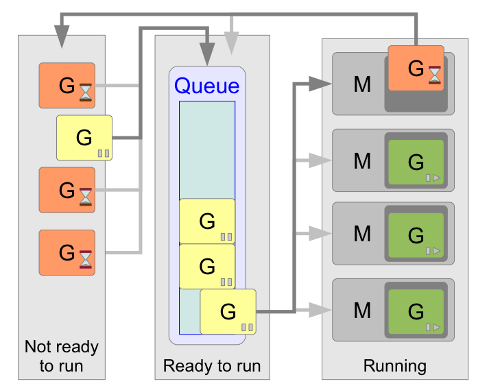

## Горутины

### Горутина 
— это функция, которая может работать параллельно с другими функциями в том же адресном пространстве.

Для создания горутины используется ключевое слово `go`, за которым следует вызов функции.
Пример: `go normalFunc(args...)` Функция `normalFunc(args...)` начнет выполняться асинхронно с вызвавшим ее кодом.

#### Сильные стороны горутин
- Плюс горутин в том, что горутины очень легковесны ( (интересная статья на хабре про цифры)[https://habr.com/ru/post/135587/] ). Практически все расходы — это создание стека, который очень невелик (это изменяемо, если нужно).
- Асинхронность.
- Если время выполнения функции достаточно велико и стоит нагрузить другие ядра.

#### Как можно использовать
- [простой пример последовательного и одновременного выполнения](sequentiallyAndSimultaneously.go)
- [пример точности выполнения и зависимости рутин от времени выполнения](reader.go)
- [пример записи в канал и считывания из него ](pingerAndPrinter.go)

### Системные потоки

- В исходном коде (src/pkg/runtime/proc.c) приняты такие термины:
G (Goroutine) — Горутина
M (Machine) — Машина

- Каждая Машина работает в отдельном потоке и способна выполнять только одну Горутину в момент времени. 

- Планировщик операционной системы, в которой работает программа, переключает Машины. 
- Число работающих Машин ограничено переменной среды GOMAXPROCS или функцией `runtime.GOMAXPROCS(n int)`.
По умолчанию оно равно 1. Обычно имеет смысл сделать его равным числу ядер.

### Планировщик Go

- Цель планировщика (scheduler) в том, чтобы распределять готовые к выполнению горутины (G) по свободным машинам (M).
- Готовые к исполнению горутины выполняются в порядке очереди, то есть FIFO (First In, First Out).
- Исполнение горутины прерывается только тогда, когда она уже не может выполняться: то есть из-за системного вызова или использования синхронизирующих объектов (операции с каналами, мьютексами и т.п.). 
- Не существует никаких квантов времени на работу горутины, после выполнения которых она бы заново возвращалась в очередь. Чтобы позволить планировщику сделать это, нужно самостоятельно вызвать runtime.Gosched().
- Как только функция вновь готова к выполнению, она снова попадает в очередь.

