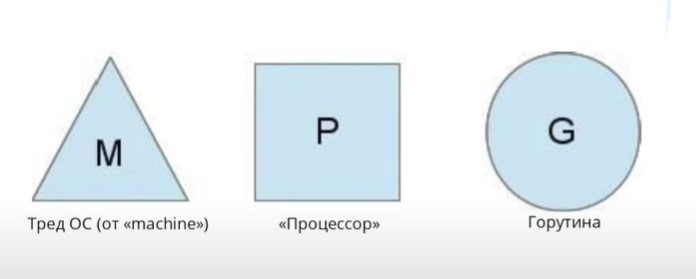
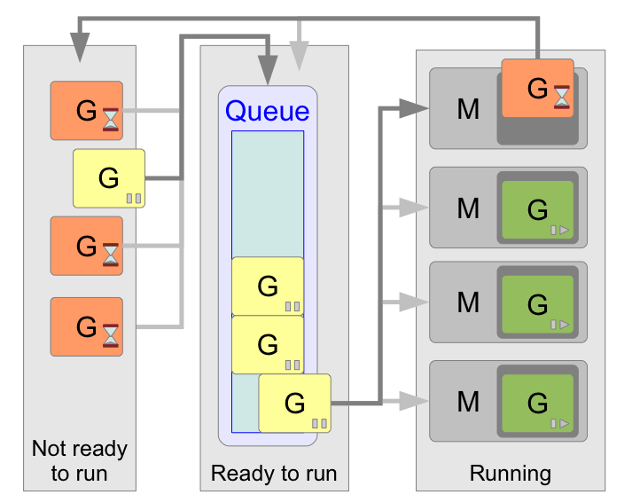

# Планировщик go
> Тут я подробно все описал - т.к. тема важная и лучше 1 раз прочитать всё, чем по частям узнавать в этих ваших интернетах
> Дописать работу под капотом: TODO;

## Введение:
В компьютера есть операционные системы (ОС), в ОС есть потоки(треды). Потоки позволяют разбивать множество программ на независимые части(по памяти и времени) и выполнять их конкурентно или ассинхронно на одном процессоре.
Однако потоки медленные и тяжелые, их трудно контролировать 'руками', поэтому разработчики go решили создать что-то покруче.
Так появились горутины, а вместе с ними и планировщик го.
#### В чем выгода:
- Контроль над выполнение асинхронных задач
- Экономия ресурсов ( до 4кб памяти в одной горутине против нескольких мегабайт в потоках)
- Эффективное переключение между задачами.

#### Что предлагают разработчики языка:
- не давать программисту в руки треды
- сделать вид, что есть только горутины и использовать их.
- запустить столько тредов, сколько доступно процессором
- распределять на эти треды сколько угодно горутин, которые запускает программист

## Планировщик

#### Внутренности
- процессор(P): количество процессоров(обычно) равно количеству ядер.
- machine(M), или нативный тред ОС: количество тредов(обычно) равно P.
- gorutine(G): количество горутин неограничено.
> Процессор и тред - не железка и не ресурс. Это структура в памяти с наборами свойств и методов. Это абстракция.

#### Схема
- У каждого процессора P сеть своя очередь горутин, которую он должен выполнить.
- При этом активна может быть только одна горутина

#### Теперь нужно поговорить о многозадачности. Многозадачность планировщика бывает:
1. _Кооперативная_ - Пусть программы уступают друг другу место и выполняются столько сколько им хочется. Данный планировщик спит пока один из потоков явно не разбудит его с намеком о готовности отдать свое место другой. Планировщик далее сам решит, надо ли убирать из контекста текущую горутину, и если да, кого поставить на ее место.
2. _Вытесняющая_ (пример планировщик ОС) - Все программы равны. Выделяется каждой строго одинаковое количество времени. Данный планировщик работает в фоне, выгружает потоки на основании различных эвристик, а вместо выгруженных процессорное время начинают получать другие потоки.

Планировщик в GO - *неявно кооперативный*. Поясняю:
- Горутина уступает место другим при обращании к вводу-выводу, каналам, вызовам ОС
- Может уступить место при вызове любой функции (некоторая вероятность)
- Явный способ переключения `runtime.Goshed()`. Но это непопулярно
- _рассматривается внедрение вытесняющую многозадачность_, вообщем хотят сделать трансформера и решить проблему когда одна горутина не уступает другим процессорное время (на 13.08.2022 еще не сделали).

### Основные принципы планировщика Go
- *Цель планировщика*: чтобы распределять готовые к выполнению горутины (G) по свободным машинам (M).
- *FIFO*. Готовые к исполнению горутины выполняются в порядке очереди, то есть FIFO (First In, First Out).
- Не существует никаких квантов времени на работу горутины, после выполнения которых она бы заново возвращалась в очередь.
- "Захват работы". Если M закончил работу со своими горутинами, то он попробует забрать горутины у других M и выполнить их работу.
- *Неинвазивность*. Выделенные M не могут самостоятельно прервать работу горутин, но это могут делать системные вызовы или использования синхронизирующих объектов (операции с каналами, мьютексами и т.п.).

### Ограничения планировщика
- *FIFO*. Нет контроля над приоритетами задач.
- *Кооперативная многозадачность*. В go нет гарантий выполнения времени горутин (например бесконечное вычисление числа pi).
- *Горутины перемещаются между тредами*. Это снижает эффективность кешей, если вы их используете

