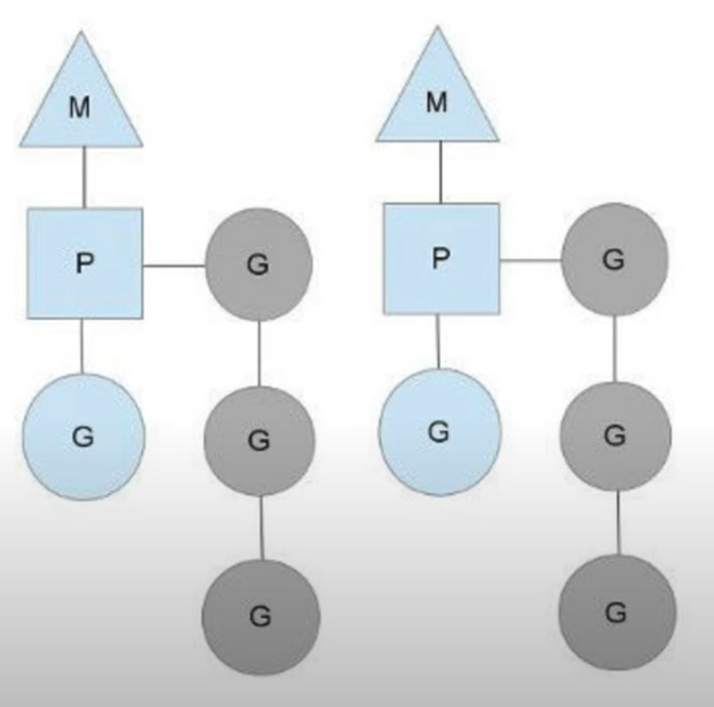

# Планировщик go
> Тут я подробно все описал - т.к. тема важная и лучше 1 раз прочитать всё, чем по частям узнавать в этих ваших интернетах
> Дописать работу под капотом: TODO;

## Введение:
В компьютера есть операционные системы (ОС), в ОС есть потоки(треды). Потоки позволяют разбивать множество программ на независимые части(по памяти и времени) и выполняют их конкурентно или ассинхронно на одном процессоре.
Однако потоки медленные и тяжелые, их трудно контролировать 'руками', поэтому разработчики go решили создать что-то покруче.
Так появились горутины, а вместе с ними и планировщик го.
#### В чем выгода:
- Контроль над выполнением асинхронных задач
- Экономия ресурсов ( до 4кб памяти в одной горутине против нескольких мегабайт в потоках)
- Эффективное переключение между задачами.

#### Что предлагают разработчики языка:
- не давать программисту в руки треды
- сделать вид, что есть только горутины и использовать их.
- запустить столько тредов, сколько доступно процессором
- распределять на эти треды сколько угодно горутин, которые запускает программист

## Планировщик

#### Внутренности
- процессор(P): количество процессоров(обычно) равно количеству ядер.
- machine(M), или нативный тред ОС: количество тредов(обычно) равно P.
- gorutine(G): количество горутин неограничено, но активна только одна.
> Процессор и тред - не железка и не ресурс. Это структура в памяти с наборами свойств и методов. Это абстракция.


#### Схема
- У каждого процессора P сеть своя очередь горутин, которую он должен выполнить.
- При этом активна может быть только одна горутина


#### Теперь нужно поговорить о многозадачности. Многозадачность планировщика бывает:
1. _Кооперативная_ - Пусть программы уступают друг другу место и выполняются столько сколько им хочется. Данный планировщик спит пока один из потоков явно не разбудит его с намеком о готовности отдать свое место другой. Планировщик далее сам решит, надо ли убирать из контекста текущую горутину, и если да, кого поставить на ее место.
2. _Вытесняющая_ (пример планировщик ОС) - Все программы равны. Выделяется каждой строго одинаковое количество времени. Данный планировщик работает в фоне, выгружает потоки на основании различных эвристик, а вместо выгруженных процессорное время начинают получать другие потоки.

#### Каким был планировщик в GO до 1.14- *неявно кооперативным*. Поясняю:
- Горутина уступает место другим при обращании к вводу-выводу, каналам, вызовам ОС
- Может уступить место при вызове любой функции (некоторая вероятность)
- Есть явный способ переключения `runtime.Goshed()`.
- _рассматривается внедрение вытесняющей многозадачности_, вообщем хотят сделать трансформера и решить проблему когда одна горутина не уступает другим процессорное время.

#### Какой планировщик в GO сейчас - не кооперативный:
- Решена проблема, когда горутина захватывает P и подолгу не дает другим горутинам выполниться на этом P.

Вот кстати решение этой проблемы:
- Сделали так же, как и в планировщике ОС. Рантайм GO теперь может вытеснить горутину из P и положить туда другую, а для этого используют средства ОС.

<details>
    <summary>Окей, как это реализовать?</summary>

    Мы позволим рантайму отправлять сигнал потоку на котором работает горутина. Обработчик этого сигнала зарегистрируем на каждом потоке из M, задача обработчика — определить можно ли вытеснить текущую горутину. Если да — сохраним ее текущее состояние (регистры и состояние стека) и дадим ресурсы другой, иначе — продолжим выполнение текущей горутины. Стоит заметить, что, концепция с сигналом — это решение для UNIX-base систем, в то время как, например, реализация для Windows несколько отличается. Кстати, сигналом для отправки был выбран SIGURG.

    Наиболее сложная часть данной реализации состоит в определении — может ли горутина быть вытеснена. Дело в том, что некоторые места в нашем коде должны быть атомарными, с точки зрения garbage collector'а. Назовем такие места unsafe-point'ами. Если мы вытесним горутину в момент выполнения кода из unsafe-point'а, а затем запустится GC, то он застанет состояние нашей горутины, снятое в unsafe-point'e, и может натворить дел.

    Если интересно можно посмотреть на внутренности:
    wantAsyncPreempt — проверяем «хочет ли» G вытесняться, тут, например, проверится валидность текущего статуса горутины.
    isAsyncSafePoint — проверяем, можно ли вытеснить прямо сейчас. Самая интересная из проверок здесь — находится ли G в safe или unsafe point'е. Кроме того, мы должны быть уверены, что поток, на котором выполняется G, так же готов к вытеснению G.
</details>

### Основные принципы планировщика Go
1. *Цель планировщика*: чтобы распределять готовые к выполнению горутины (G) по свободным машинам (M).
2. *FIFO*. Готовые к исполнению горутины выполняются в порядке очереди, то есть FIFO (First In, First Out).
3. Не существует никаких квантов времени на работу горутины, после выполнения которых она бы заново возвращалась в очередь.
4. "Захват работы". Если M закончил работу со своими горутинами, то он попробует забрать горутины у других M и выполнить их работу.
5. Если планировщик решает, что горутина работает слишком долго `runtime/proc.go (retake)` то он откладывает её и выполняет другую.
```go
if pd.schedwhen+forcePreemptNS <= now {
    signalM(_p_)
}
// forcePreemptNS — константа равная 10мс, pd.schedwhen — время когда крайний раз вызывался планировщик для потока pd
```


### Ограничения планировщика
- *FIFO*. Нет контроля над приоритетами задач.
- *Горутины перемещаются между тредами*. Это снижает эффективность кешей, если вы их используете

