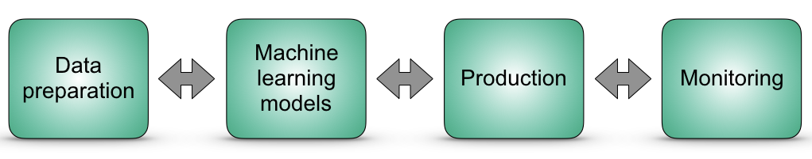

# MLOps
MLOps — это набор процедур, направленных на последовательное и эффективное внедрение и поддержку моделей машинного обучения (ML), используемых в производстве. 

Идея в том, чтобы разработать удобную среду объединяющую Devops, Data Engineering, Machine Learning.

## Ради чего это делают
* Ускорение dev to prod
* Меньше времени на сбор и подготовку данных
* Масштабируемсоть
* Снижение рисков
* Уменьшение предвзятости
* Простота развертывания высокоточных моделей

## Этапы MLOps

Подготовка данных - доступ к историческим или онлайн данным из различных источников, а также возможность хранить и организовывать данные таким образом, чтобы обеспечить быстрый и простой анализ. Этот этап включает в себя сбор и подготовку данных для моделирования.

Разработка машинного обучения - При построении моделей специалисты по анализу данных обычно следуют следующим шагам: Извлечь данные из внешнего источника, затем провести их маркировку для выявления потенциальных закономерностей. Далее следует обучение и проверка модели. На этом этапе команды машинного обучения используют MLOps для создания конвейеров машинного обучения, которые автоматически собирают и подготавливают данные, выбирают оптимальные характеристики, обучают модели с использованием нескольких наборов параметров или алгоритмов, оценивают модели и проводят различные тесты моделей и систем.

Производственное развертывание - Используется для связи с реальным миром, а также с бизнес-приложением или внешними службами. Все ML-приложение должно быть развернуто без перебоев в работе.

Мониторинг - Команды ML должны добавлять данные, код и отслеживать данные на предмет проблем с качеством, проверять модели на предмет дрейфа концепций и повышать точность моделей, используя, в частности, подходы AutoML и ансамбли. Этот этап включает в себя мониторинг модели и инфраструктуры.