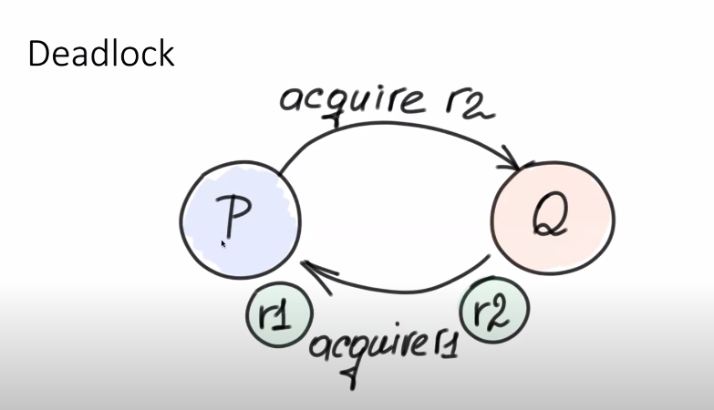
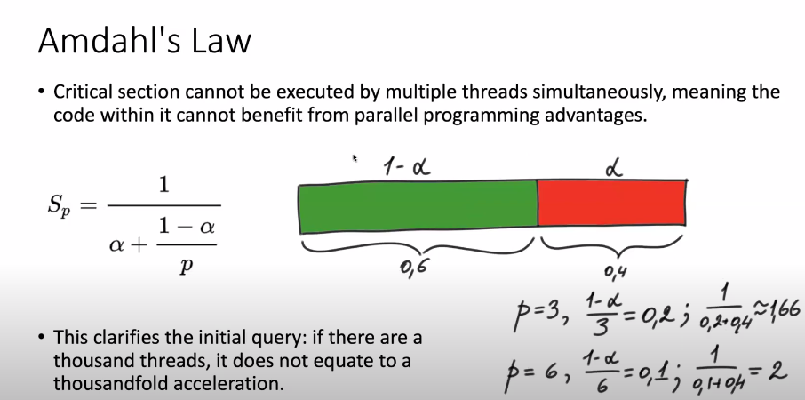
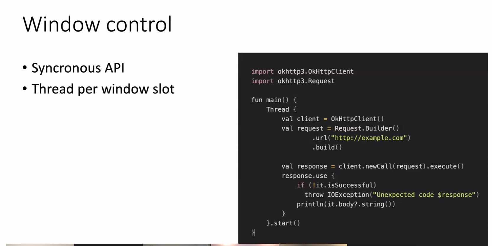
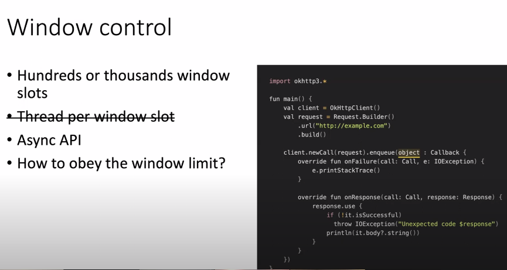
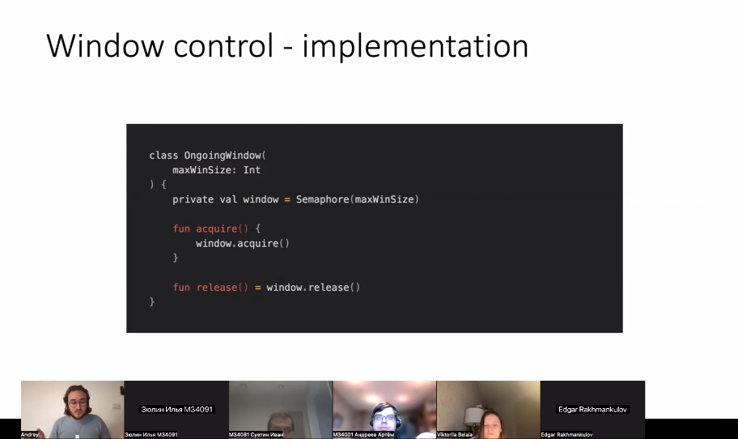
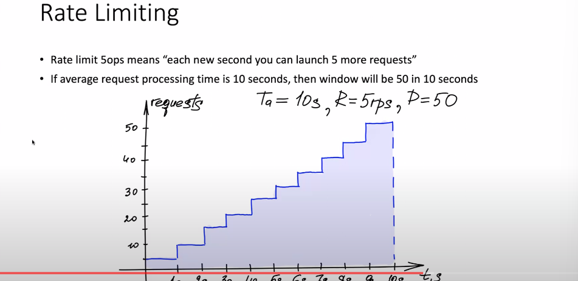
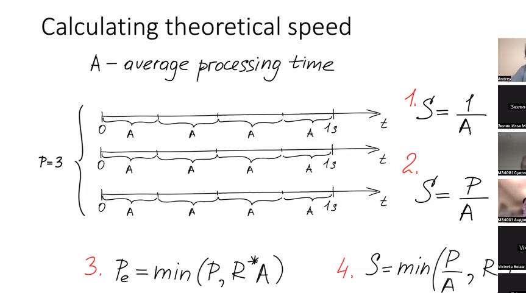

# Многопоточность
— свойство платформы (например, операционной системы, виртуальной машины и т. д.) или приложения, состоящее в том, что процесс, порождённый в операционной системе, может состоять из нескольких потоков, выполняющихся «параллельно», то есть без предписанного порядка во времени. При выполнении некоторых задач такое разделение может достичь более эффективного использования ресурсов вычислительной машины.

### С точки зрения пользователя:
`Процесс` — экземпляр программы во время выполнения.
`Потоки` — ветви кода, выполняющиеся «параллельно», то есть без предписанного порядка во времени.

### С точки зрения операционной системы:
`Процесс` — это абстракция, реализованная на уровне операционной системы. Процесс был придуман для организации всех данных, необходимых для работы программы.
`Поток` — это просто контейнер, в котором находятся ресурсы программы: Счётчик команд,Регистры, Стек.

Несколько потоков могут выполняться в контексте процесса. Все потоки процесса используют общий диапазон виртуальных адресов

### Отличие процесса от потока
Процесс — это всего лишь способ сгруппировать взаимосвязанные данные и ресурсы, а потоки — это единицы выполнения (unit of execution), которые выполняются на процессоре

### Ассинхронность
`Асинхронное программирование` — это подход к написанию кода, при котором несколько задач выполняются параллельно и независимо друг от друга.

### Ограничение доступа
Переменные на стеке - не подвержены видимости для ассинхронного кода.

### Недетерминизм
Потоки, как модель вычислений, являются очень недетерминированными, а работа программ также становится неопределенной.

### Race condition
`Race condition (состояние гонки)` - это ситуация, при которой несколько потоков (или процессов) одновременно пытаются выполнить операции чтения или записи к общим ресурсам без должной синхронизации.

`Решение` - использовать локи и mutex-ы (mutal exclusive).
Как правило, состояние гонки протекают по определенной схеме:

- Критическая секция: Это участок кода, в котором происходит обращение к общим ресурсам и их модификация.

- Синхронизация: Отсутствие надлежащих механизмов синхронизации может позволить нескольким процессам одновременно войти в критическую секцию.

- Непредсказуемый результат: Из-за одновременного выполнения конечное состояние общего ресурса становится неопределенным.

### Deadlock
Cитуация в многопоточной среде или СУБД, при которой несколько процессов находятся в состоянии бесконечного ожидания ресурсов, захваченных самими этими процессами.

Если шедулер кооперативный - то нам пиздец (либо ставим таймаут)

### Как защищать веб-приложение
Одним из наиболее эффективных способов предотвращения уязвимостей состояния гонки является использование `механизмов блокировки`. `Механизмы блокировки` обеспечивают одновременный доступ к общему ресурсу только одного процесса, не позволяя другим процессам вмешиваться в работу ресурса.

`Семафоры` - это один из видов механизмов блокировки, который часто используется для предотвращения условий гонки. Семафоры работают путем присвоения ресурсу значения, указывающего доступен он или нет. Когда процесс пытается получить доступ к ресурсу, он проверяет значение семафора. Если ресурс недоступен, процесс ждет, пока он не станет доступен.

`Мьютексы` - это тип механизма блокировки, аналогичный семафорам. Мьютексы работают, позволяя только одному процессу одновременно получать доступ к общему ресурсу. Когда процесс пытается получить доступ к ресурсу, он проверяет состояние мьютекса.

`Атомарные операции` являются разновидностью низкоуровневого механизма синхронизации. Он обеспечивает выполнение операций процесса за один, неделимый шаг. Это не позволяет другим процессам вмешиваться в работу с ресурсом во время выполнения операции.

### Amdahl's Law

## Шедулер
С не кооперативной (вытесняющей) многозадачностью мы все с вами прекрасно знакомы на примере планировщика ОС. Данный планировщик работает в фоне, выгружает потоки на основании различных эвристик, а вместо выгруженных процессорное время начинают получать другие потоки.

Для кооперативного планировщика характерно другое поведение — он спит пока одна из горутин явно не разбудит его с намеком о готовности отдать свое место другой. Планировщик далее сам решит, надо ли убирать из контекста текущую горутину, и если да, кого поставить на ее место. 

## Контекст
`Контекст потока` содержит все сведения, позволяющие потоку безболезненно возобновить выполнение, в том числе набор регистров процессора и стек потока.

# 2 lab

## Bandwidth and Throughput
- пропускная способность.
Bandwidth - какой пропускной способности можно достичь в соединении.
В многопоточности термин `throughput` (пропускная способность) обычно относится к количеству работ, которые система или процессор может обработать за определенное время. Это показатель эффективности системы в обработке задач параллельно.

Perfomance - показатель "выгодности" приложения, которое обычно отображает какую-то метрику.

## Window control - Ограничение потоков на кол-во 

## Rate limit - Ограничение потоков на рпс

# Theoretical speed - Теоретическая скорость для аккаунта

