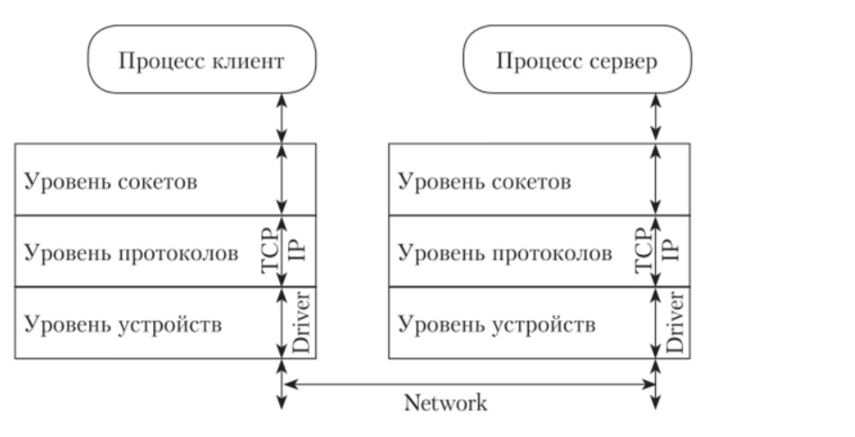

# Сокет
## Структура ОС
Структура ядра в ОС имеет три уровня поддержания работы в сети: сокетов, протоколов и устройств

### Внутренности
Сокет - название программного интерфейса для обеспечения обмена данными между процессами, это абстракция сетевого взаимодействия в операционной системе Linux.
Имплементация в ОС для каждого сокета - пара IP-адрес + id порта.
Верное название этой имплементации - "Интернет сокет".

Абстракция используется для того, чтобы операционная система могла работать с любым типом канала передачи данных.
Именно поэтому в ОС Linux Интернет сокет - это дескриптор, с которым система работает как с файлом.

В ядре ОС Linux сокеты представлены тремя основными структурами:
1. `struct socket` - представление сокета BSD, того вида сокета, который стал основой для современных "Интернет сокетов";
2. `struct sock` - собственная оболочка, которая в Linux называется "INET socket";
3. `struct sk_buff` - "хранилище" данных, которые передает или получает сокет;

Работа с ними возможна при использовании языка программирования или специальных оберток и написания приложения. Для эффективного управления этими структурами нужно знать, какие типы операций над сокетами существуют и когда их применять.

### Для сокетов существует набор стандартных действий:
- Общие
    - Socket -Создать новый сокет и вернуть файловый дескриптор
    - Send - Отправить данные по сети
    - Receive -Получить данные из сети
    - Close	- Закрыть соединение

- Серверные
    - Bind - Связать сокет с IP-адресом и портом
    - Listen - Объявить о желании принимать соединения. Слушает порт и ждет когда будет установлено соединение
    - Accept - Принять запрос на установку соединения

- Клиентские
    - Connect - Установить соединение
> Полезно погуглить примеры

### Механизм и назначение

Сокеты представляют собой в определенном смысле обобщение механизма каналов, но с учетом возможных особенностей, возникающих при работе в сети. Кроме того, они предоставляют больше возможностей по передаче сообщений, например, могут поддерживать передачу экстренных сообщений вне общего потока данных. Общая схема работы с сокетами любого типа такова: каждый из взаимодействующих процессов должен на своей стороне создать и отконфигурировать сокет, после чего процессы должны осуществить соединение с использованием этой пары сокетов. По окончании взаимодействия сокеты уничтожаются.

Механизм сокетов чрезвычайно удобен при разработке взаимодействующих приложений, образующих систему «клиент-сервер». Клиент посылает серверу запросы на предоставление услуги, а сервер отвечает на эти запросы.

#### Пайплайн:
Схема использования механизма сокетов для взаимодействия в рамках модели «клиент-сервер» такова. Процесс-сервер запрашивает у ОС сокет и, получив его, присваивает ему некоторое имя (адрес), которое предполагается заранее известным всем клиентам, которые захотят общаться с данным сервером. После этого сервер переходит в режим ожидания и обработки запросов от клиентов. Клиент, со своей стороны, тоже создает сокет и запрашивает соединение своего сокета с сокетом сервера, имеющим известное ему имя (адрес). После того, как соединение будет установлено, клиент и сервер могут обмениваться данными через соединенную пару сокетов.