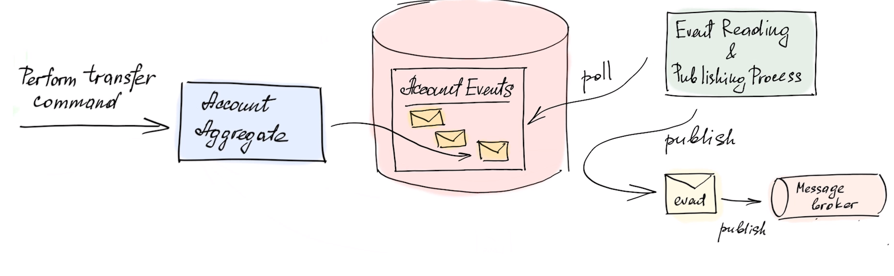

# Предметно-ориентированное проектирование

-- только информация из лекций (итмо)

## Ограниченный Контекст (Bounded Context)
TODO

## Value-Object
TODO

## ANY(TODO)

## Агрегаты
Агрегаты представляют из себя автономную единицу, обладающую состояниями. Агрегат это дерево сущностей 
(может включать в себя другие сущности).

Например, для интернет-магазина, "заказ" - хороший пример агрегата. Жизненный цикл агрегатов связан с изменением их состояний.

### Свойства агрегатов

Агрегаты подразумевают использование транзакционных систем в реляционных базах данных 
(которые удовлетворяют [ACID](https://github.com/babtiss/cheat-sheet/tree/master/data_base/acid) требованиям)

Инварианты - неизменяемые свойства, которые должны выполняться при изменении системы. 
(Могут быть нарушены при определенной настройке транзакций)

Аномалии - (тема транзакций) аномалия, которая возникает (один из примеров) при ситуации когда мы из двух разных транзакций пытаемся изменить одни и те же данные 
(например, ячейки А и В) так, что первая транзакция затронет ячейку A, а вторая — ячейку В и мы получим неконсистентный результат.

Оптимистичная блокировка - (тема транзакций) настройка уровня изоляций, позволяющий избавиться от возможных аномалий.

### Как хранятся агрегаты в базе данных
На примере `mongoDB` данные хранятся как документ с деревом сущностей.
Для изменения подсущности - достается все дерево.

Чем больше сущностей мы объединим в один агрегат, тем больше мы потребляем памяти и ресурсов.

### Transactional outbox pattern
Типы сообщений:
1. `Comands` - операции, обновляющие наши агрегаты (`create`, `update`). Включает в себя *валидацию*, *инварианты*.
2. `Query` - операции на чтение данных (`get`, `find`, `filter`).
3. `Events` - операции, описывающие факт совершенного изменения (`has been created`).

`Comands` могут порождать `Events` (Одна команда -> один ивент ; Одна команда -> много ивентов).

Проблема:
Есть command над агрегатом, он порождает update в базу данных и event для мессадж брокера.
Ивенты, попадающие в мессадж брокер могут быть не в том порядке или вообще не прийти (если упал сервис, моргнула сеть).

Решение:
Необходимо свойство атомарности между обновлениями. 

`Transactional outbox pattern` подразумевает в рамках 1 транзакции создать event для DB и создать event для message broker.

Как это выглядит для базы данных:
Нужна таблица агрегатов и таблица ивентов, а так же база данных должа поддерживать ACID:

Можно использовать атомарную запись документов и убрать из базы данных таблицу агрегатов 
(тогда получим Event sourcing систему):
